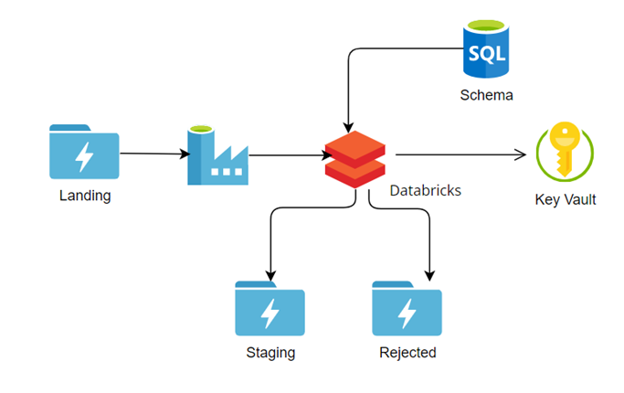

# DE_Project_SchemaValidation
E2E DE project in which incoming file is validated , if all validations are passed then it will be place into staging folder else it will be placed into rejected folder. Tools Used - Az Databricks,ADLS, AZ- KeyVault,AZSQL Server

## High Level Project Info.
Internal Application Sends CSV file into ADLS Storage.
Validation needs to be Applied on the incoming CSV file.
Reject the CSV File if:
1. It containt duplicate rows
2. Validate the Date format is accurate

### Architecture Diagram

Let's Understand the components of architecture diagram.
1. ADLS - Azure DataLake  Storage Gen2:
   ADLS follows DFS (Distributed file system) protocol which is useful for big data analytics and parallel processing.
   Query Performance- When sending a query that is only retrieving a subset of data, with a hierarchical file system      like ADLS Gen2 it is possible to leverage partition scans for data pruning
 2. Azure Data Factory:
    Azure Data Factory (ADF) is the cloud-based Extract, Transform and Load (ETL) and data integration service that       allows you to create data-driven workflows for orchestrating data movement and transforming data at scale.
 3. Azure DataBricks -
    Databricks Azure is a service on the Microsoft Azure cloud that uses Apache Spark to process and analyze large       data workloads.It supports multiple programming languages and libraries for data transformation, exploration and 
    machine  learning.  It also enables collaboration between different data roles and integrates with other Azure 
    platforms.
4. Azure key Vault - Azure Key vault is used to manage your secrets in azure. we can connect azure key vault to          different services of azure
5. Azure SQL Database: Azure SQL Database is a relational database service provided by Azure.

###### Use of Each Component in Project
   

